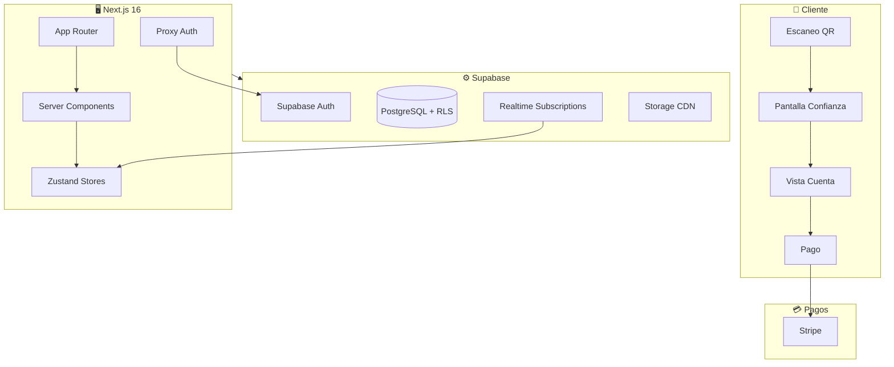

# 💸 Tally

<div align="center">


**SaaS de pago para restaurantes** con sistema de división de cuenta en tiempo real, escaneo QR y panel de administración.

</div>

---

## 📋 Descripción

Plataforma de pagos para restaurantes que permite a los comensales dividir la cuenta de forma inteligente tras escanear un código QR en la mesa. Construido con Next.js 16, React 19 y Supabase, priorizando la experiencia móvil y la velocidad de transacción.

El diseño sigue una estética de **Warm Minimalism**: interfaces limpias con colores cálidos que transmiten confianza en el contexto de pagos. Tema dual, tipografía Inter/Lora y micro-animaciones con Framer Motion.

---

## ✨ Características

### 📱 Flujo del Cliente

- **Escaneo QR** → Pantalla de confianza → Vista de cuenta → Selección de items → Pago
- **División inteligente**: por items, por cantidad fija o partes iguales
- **Propinas personalizables** con porcentajes sugeridos
- **Sincronización en tiempo real** entre comensales de la misma mesa
- **Recibos digitales** automáticos post-pago

### 🍽️ Panel de Administración

- **Gestión de menú** con drag & drop (categorías y productos)
- **Gestión de mesas** con códigos QR únicos
- **Configuración de restaurante** (tema, propinas, moneda)
- **Dashboard** con métricas de ventas y transacciones

### 🖥️ POS para Staff

- **Vista de pedidos activos** en tiempo real
- **Control de estado de mesas** (libre, ocupada, pagando)
- **Acciones rápidas** para asistencia al cliente

---

## 🏗️ Arquitectura



### Stack Tecnológico

| Categoría     | Tecnología                       |
| ------------- | -------------------------------- |
| Framework     | Next.js 16 (App Router)          |
| UI            | React 19 + TailwindCSS 4         |
| Estado        | Zustand + Immer                  |
| Base de datos | Supabase (PostgreSQL + RLS)      |
| Autenticación | Supabase Auth + Proxy middleware |
| Formularios   | React Hook Form + Zod            |
| Componentes   | Radix UI + custom                |
| Animaciones   | Framer Motion                    |
| Drag & Drop   | dnd-kit                          |
| Testing       | Vitest + Testing Library         |

---

## 📁 Estructura

```text
src/
├── app/                    # Next.js App Router
│   ├── (marketing)/       # Landing pages públicas
│   ├── [slug]/            # Flujo cliente (trust → bill → payment)
│   ├── admin/             # Panel de administración
│   ├── pos/               # Point of Sale para staff
│   └── api/               # API Routes
├── components/            # Componentes React por dominio
├── lib/                   # Utilidades y configuraciones
│   ├── api/               # Validación Zod y helpers
│   └── supabase/          # Clientes Supabase
├── stores/                # Estado global (Zustand)
└── types/                 # Tipos TypeScript
```

---

## 🔐 Seguridad

| Capa            | Implementación                               |
| --------------- | -------------------------------------------- |
| **Proxy**       | `proxy.ts` protege `/admin/*` y `/pos/*`     |
| **API**         | Validación Zod + verificación de usuario     |
| **Base datos**  | Row Level Security (RLS) en todas las tablas |
| **Auth**        | `getUser()` en servidor (no `getSession()`)  |
| **Service Key** | Solo en API routes server-side               |

---

## 💡 Decisiones de Desarrollo

| Decisión            | Justificación                                                       |
| ------------------- | ------------------------------------------------------------------- |
| **Next.js 16**      | App Router, proxy.ts, Server Components, optimizaciones automáticas |
| **Supabase**        | PostgreSQL completo, RLS, realtime y auth integrados                |
| **Zustand + Immer** | Estado simple y performante con updates inmutables                  |
| **TailwindCSS 4**   | CSS-first config, mejor performance, design tokens nativos          |
| **Zod en API**      | Validación type-safe con errores descriptivos                       |
| **Vitest**          | Testing rápido compatible con Vite, mocks para Next.js y Supabase   |
| **Warm Minimalism** | Estética que transmite confianza para contexto de pagos             |

---

<div align="center">

**Álvaro Lostal**

[](https://lostal.dev)
[](https://github.com/lostal)
[](https://linkedin.com/in/alvarolostal)

</div>

---

<div align="center">

⭐ **¿Te gusta este proyecto?** ¡Dale una estrella para apoyar mi trabajo!

</div>
