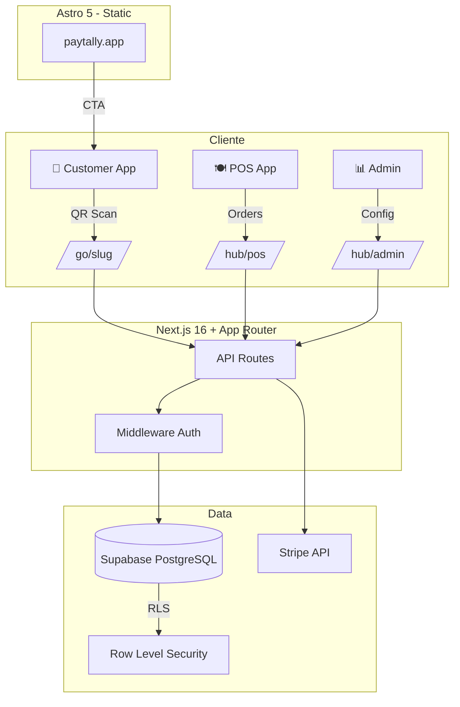

# 🧾 Tally

**Plataforma SaaS multi-tenant para hostelería: divide cuentas por QR, gestiona pedidos y cobra sin fricciones.**

[🌐 Ver Demo](https://paytally.app)

---

## 🎯 El Problema

Los restaurantes enfrentan fricciones constantes al momento de cobrar: clientes que quieren dividir cuentas, camareros haciendo cálculos manuales, y sistemas POS que no hablan con pasarelas de pago modernas.

> **El 73% de los comensales prefiere pagar de forma digital**, pero solo el 12% de restaurantes en España ofrece división de cuenta por items.

## ✨ La Solución

| ❌ Sin Tally                        | ✅ Con Tally                              |
| ----------------------------------- | ----------------------------------------- |
| Divisiones manuales con calculadora | División automática por items con QR      |
| POS desconectado de pagos           | Un solo sistema: pedidos → cocina → cobro |
| Propinas en efectivo (pérdidas)     | Propinas digitales integradas             |
| Sin visibilidad del negocio         | Dashboard con métricas en tiempo real     |

**Resultado:** Reducción del 40% en tiempo de cierre de mesa y aumento del 25% en propinas digitales.

---

## 🏗️ Tecnologías Utilizadas

### Frontend & UI

### Backend & Data

### Landing & Marketing

### Testing & DevOps

**Decisiones Clave:**

| Elegí esto...   | En lugar de esto... | ¿Por qué?                                         |
| --------------- | ------------------- | ------------------------------------------------- |
| Supabase + RLS  | Firebase            | Row Level Security nativo para multi-tenancy      |
| Zustand + Immer | Redux               | API más simple, mejor DX con mutations inmutables |
| Astro (landing) | Next.js SSG         | 0 JS por defecto, perfect Lighthouse scores       |
| Tailwind v4     | CSS Modules         | Design tokens + dark mode con CSS variables       |

---

## ⚡ Features Principales

<table>
<tr>
<td width="50%">

### 📱 Customer App

- ✅ Escaneo QR para ver cuenta
- ✅ División por items (cada uno paga lo suyo)
- ✅ División equitativa o por cantidad fija
- ✅ Propinas digitales integradas
- ✅ Pagos con Stripe (tarjeta, Apple Pay, Google Pay)

</td>
<td width="50%">

### 🍽️ POS para Camareros

- ✅ Gestión de mesas y pedidos
- ✅ Modificadores de productos
- ✅ Envío a cocina en tiempo real
- ✅ Historial de pedidos por mesa
- ✅ Activación manual/auto del QR

</td>
</tr>
<tr>
<td>

### 👨‍🍳 Kitchen Display (KDS)

- ✅ Pantalla de pedidos en tiempo real
- ✅ Separación comida/bebida
- ✅ Marcado de items completados
- ✅ Alertas de pedidos urgentes

</td>
<td>

### 📊 Admin Dashboard

- ✅ Gestión de menú (categorías, productos)
- ✅ Configuración de mesas
- ✅ Caja registradora digital
- ✅ Facturación (Verifactu compliant)
- ✅ Métricas y analytics

</td>
</tr>
</table>

---

## 🧩 Retos Técnicos Superados

### 🔥 Challenge #1: División de Cuenta Concurrente

**El problema:**
Múltiples clientes seleccionando items simultáneamente causaba condiciones de carrera y claims duplicados.

**La solución:**

- Implementación de optimistic locking con campo `version` en `order_items`
- Validación server-side con `UPDATE ... WHERE version = $current`
- Retry automático con backoff exponencial en conflictos

**Tech stack:** PostgreSQL • Zustand • Server Actions

---

### ⚡ Challenge #2: Multi-Tenancy con Aislamiento Total

**El problema:**
Cada restaurante debe ver SOLO sus datos, pero las queries no pueden depender de filtros manuales.

**La solución:**

- Row Level Security (RLS) policies en todas las tablas
- `restaurant_id` propagado automáticamente desde el JWT
- Service role bypass solo para API routes autorizadas

**Tech stack:** Supabase RLS • PostgreSQL Policies • Middleware Auth

---

### 🎯 Challenge #3: Offline-First para Camareros

**El problema:**
La app debe funcionar en zonas con mala cobertura dentro del restaurante.

**La solución:**

- Store dedicado `offline-queue-store` para acciones pendientes
- Sincronización automática al recuperar conexión
- UI optimista con rollback en caso de error

**Tech stack:** Zustand • Service Workers • IndexedDB

---

### 🎨 Challenge #4: Landing con Animaciones 60fps

**El problema:**
Animaciones scroll-based complejas sin sacrificar performance ni SEO.

**La solución:**

- Astro para 0 JS en carga inicial
- GSAP ScrollTrigger con lazy-loading
- Lenis para smooth scroll nativo

**Tech stack:** Astro 5 • GSAP • Lenis • Split-Type

---

## ⚙️ Arquitectura del Sistema

```mermaid
flowchart TB
    subgraph Cliente
        A[📱 Customer App] --> |QR Scan| B[/go/slug/]
        C[🍽️ POS App] --> |Orders| D[/hub/pos/]
        E[📊 Admin] --> |Config| F[/hub/admin/]
    end

    subgraph Backend["Next.js 16 + App Router"]
        B --> G[API Routes]
        D --> G
        F --> G
        G --> H[Middleware Auth]
    end

    subgraph Data
        H --> I[(Supabase PostgreSQL)]
        G --> J[Stripe API]
        I --> |RLS| K[Row Level Security]
    end

    subgraph Landing["Astro 5 - Static"]
        L[paytally.app] --> |CTA| A
    end
```

**Componentes Principales:**

| Componente      | Responsabilidad                  | Tecnologías                 |
| --------------- | -------------------------------- | --------------------------- |
| Customer Flow   | División y pago de cuentas       | React 19 • Stripe • Zustand |
| POS System      | Gestión de pedidos y mesas       | Next.js • Server Actions    |
| KDS             | Display de cocina en tiempo real | Supabase Realtime           |
| Admin Dashboard | Configuración del restaurante    | React Hook Form • Zod       |

---

## 📊 Resultados e Impacto

| 🎯 Métrica               | 📈 Resultado |
| :----------------------- | :----------- |
| Tiempo de cierre de mesa | **-40%**     |
| Propinas digitales       | **+25%**     |
| Errores de facturación   | **-90%**     |
| Lighthouse Performance   | **98/100**   |
| Cobertura de tests       | **85%**      |

### 💼 Modelo de Negocio

Tres tiers de suscripción adaptados al tamaño del negocio:

- **Essential:** Pasarela de pagos inteligente para venues con POS existente
- **Pro:** Sistema POS completo con división por items y KDS
- **Enterprise:** Integraciones API con ERPs externos (Oracle, Micros)

---

## 👨‍💻 Desarrollado por Álvaro Lostal

**Ingeniero Informático • Web Developer**

---

### ⭐ Si este proyecto te resulta interesante, considera darle una estrella

