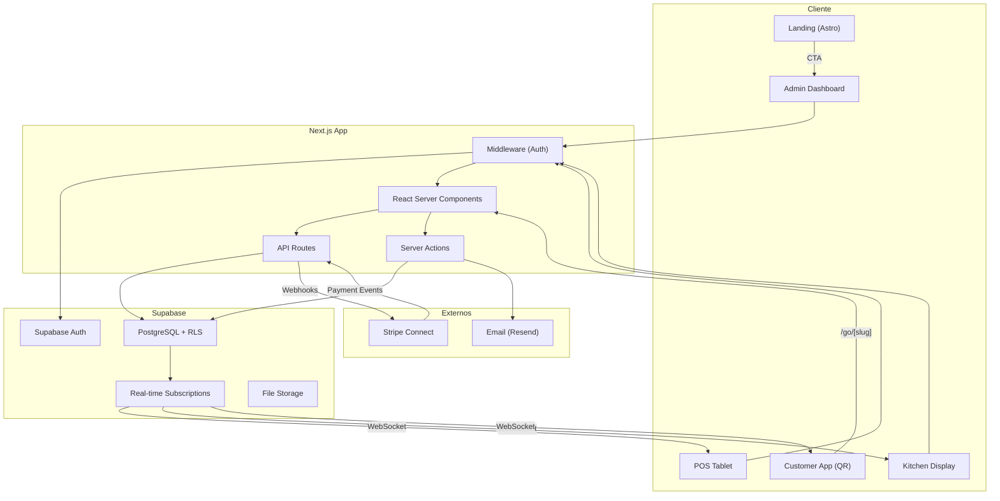

# ▎Tally

**Sistema operativo para restaurantes con división inteligente de cuentas mediante QR**

[Demo](https://app.paytally.app) · [Landing](https://paytally.app)

---

## Presentación

Tally es un SaaS B2B multi-tenant que transforma la gestión de restaurantes. Reemplaza TPVs obsoletos combinando punto de venta (POS), cocina en tiempo real (KDS) y una experiencia de pago única donde los comensales dividen la cuenta escaneando un QR.

La propuesta de valor diferencial está en el **bill splitting colaborativo**: cada comensal ve los ítems de la mesa, selecciona lo que consumió y paga su parte con Stripe. El camarero se despreocupa del cálculo y los conflictos típicos de "¿quién pidió qué?".

El sistema soporta tres tiers de suscripción que escalan desde cafeterías con TPV legacy (solo pagos digitales) hasta cadenas con integración ERP completa.

---

## Stack Tecnológico

| Área        | Tecnología                            | Razón de uso                                                                |
| ----------- | ------------------------------------- | --------------------------------------------------------------------------- |
| Framework   | Next.js 16 (App Router)               | Server Components, Server Actions, y optimización automática de rendimiento |
| UI          | React 19 + Tailwind CSS v4            | Concurrent features, design system con tokens CSS nativos                   |
| Landing     | Astro 5                               | Output 100% estático, zero JavaScript por defecto, deploy en CDN global     |
| Database    | Supabase (PostgreSQL)                 | Row Level Security para aislamiento multi-tenant, real-time subscriptions   |
| Auth        | Supabase Auth                         | SSO, magic links, y gestión de sesiones integrada con RLS                   |
| Pagos       | Stripe Connect                        | Split payments, webhooks robustos, cumplimiento PCI                         |
| State       | Zustand + Immer                       | Estado inmutable con API minimal, sin boilerplate                           |
| Validación  | Zod                                   | Esquemas compartidos entre cliente y servidor, type-safe                    |
| Animaciones | Motion (app) / GSAP + Lenis (landing) | Animaciones fluidas con scroll hijacking suave                              |
| Testing     | Vitest + Playwright                   | Unit tests rápidos, E2E para flujos críticos de pago                        |

---

## Funcionalidades Destacadas

### Punto de Venta (POS)

- Mapa visual de mesas con estados en tiempo real
- Toma de comanda con modificadores y notas de cocina
- Flujo de cobro configurable: automático (QR siempre activo) o manual (camarero habilita)
- Gestión de caja con arqueos y movimientos

### Cocina (KDS)

- Semáforo de tiempos por pedido con código de colores
- Smart routing: filtro automático cocina vs barra según categoría
- Recall de tickets eliminados por error
- Notificaciones push al camarero cuando el plato está listo

### División de Cuenta (Customer App)

- Escaneo QR → selección de ítems → pago en 30 segundos
- Tres modos: dividir por ítems, partes iguales, o cantidad fija
- Propinas digitales integradas
- Waiting room con estado del pago en tiempo real

### Administración

- Dashboard con métricas de ventas y ocupación
- Gestión de menú: categorías, productos, modificadores, precios
- Control de mesas y zonas del local
- Onboarding wizard para nuevos restaurantes

### Fiscal (España)

- Generación de facturas simplificadas
- Preparado para Verifactu (sistema de verificación fiscal)
- Audit log completo de operaciones

---

## Decisiones Técnicas

| Decisión                            | Justificación                                                                                                                                     |
| ----------------------------------- | ------------------------------------------------------------------------------------------------------------------------------------------------- |
| Path-based routing sobre subdomains | Simplifica certificados SSL, deploy, y configuración de CORS. Un solo dominio `app.paytally.app` con rutas `/hub/admin`, `/hub/pos`, `/go/[slug]` |
| Server Actions para mutaciones      | Evita duplicar validación cliente/servidor. Zod valida una vez, TypeScript infiere tipos en ambos lados                                           |
| Optimistic locking con versión      | Múltiples camareros pueden modificar la misma mesa. Cada item tiene `version` para detectar conflictos y hacer rollback limpio                    |
| RLS policies sobre middleware       | El aislamiento tenant ocurre en la base de datos, no en código. Imposible que un bug exponga datos de otro restaurante                            |
| Landing separada en Astro           | Zero dependencia del runtime Next.js. Deploy en Cloudflare Pages con cache global, mientras la app corre en Vercel                                |
| Zustand sobre Context API           | Stores modulares sin prop drilling. El store de pagos no re-renderiza el componente de menú                                                       |
| CSS variables para theming          | Los restaurantes pueden personalizar colores. Las variables se inyectan en runtime sin rebuild                                                    |
| Offline queue store                 | El POS puede tomar comandas sin conexión. Se sincronizan cuando vuelve la red                                                                     |

---

## Retos Técnicos

### Sincronización real-time sin conflictos

- **Problema**: Múltiples comensales seleccionando ítems simultáneamente causan race conditions. El comensal A marca "Hamburguesa" mientras B hace lo mismo.
- **Solución**: Optimistic locking con timestamp + `claimed_by` + `version`. El primero en confirmar gana, el segundo ve el item como "ya reclamado" y puede contestar.
- **Tech**: Supabase Real-time subscriptions, PostgreSQL row-level locking

### Flujo de pago atómico multi-participante

- **Problema**: Si 4 comensales pagan, y el tercero falla, ¿qué pasa con los otros 3?
- **Solución**: Payment sessions con estados (`pending`, `partial`, `complete`). Cada pago individual es independiente pero trackea el total. Si alguien falla, los demás no se ven afectados.
- **Tech**: Stripe Payment Intents, webhooks idempotentes, reconciliación automática

### Cumplimiento fiscal español (Verifactu)

- **Problema**: Las facturas deben generarse con formato específico, encadenadas criptográficamente, y reportadas a la AEAT.
- **Solución**: Tabla `invoices` con campos para serie, número correlativo, hash del anterior, y estado de envío. Preparado para la API oficial cuando se publique.
- **Tech**: PostgreSQL sequences, triggers para auto-generación de número, campos JSONB para datos fiscales

### Performance del mapa de mesas en tiempo real

- **Problema**: 50 mesas actualizándose cada segundo saturaban la UI.
- **Solución**: Debounce de actualizaciones visuales + memoización agresiva. Solo re-renderiza la mesa que cambió, no el grid completo.
- **Tech**: React.memo, useDeferredValue, Supabase channels por restaurante

---

## Arquitectura

```mermaid
flowchart TB
    subgraph Cliente
        Landing["Landing (Astro)"]
        Admin["Admin Dashboard"]
        POS["POS Tablet"]
        KDS["Kitchen Display"]
        Customer["Customer App (QR)"]
    end

    subgraph "Next.js App"
        Middleware["Middleware (Auth)"]
        API["API Routes"]
        Actions["Server Actions"]
        RSC["React Server Components"]
    end

    subgraph Supabase
        Auth["Supabase Auth"]
        DB["PostgreSQL + RLS"]
        Realtime["Real-time Subscriptions"]
        Storage["File Storage"]
    end

    subgraph Externos
        Stripe["Stripe Connect"]
        Email["Email (Resend)"]
    end

    Landing -->|CTA| Admin
    Admin --> Middleware
    POS --> Middleware
    KDS --> Middleware
    Customer -->|"/go/[slug]"| RSC

    Middleware --> Auth
    Middleware --> RSC
    RSC --> API
    RSC --> Actions
    API --> DB
    Actions --> DB

    DB --> Realtime
    Realtime -->|WebSocket| POS
    Realtime -->|WebSocket| KDS
    Realtime -->|WebSocket| Customer

    API -->|Webhooks| Stripe
    Stripe -->|Payment Events| API
    Actions --> Email
```

### Flujo de Datos

1. **Autenticación**: Middleware intercepta `/hub/*`, verifica sesión con Supabase Auth, redirige a login si es necesario
2. **Consultas**: Los Server Components consultan directamente a PostgreSQL con RLS activo
3. **Mutaciones**: Server Actions validan con Zod, mutan la DB, y devuelven el nuevo estado
4. **Real-time**: Supabase channels notifican cambios a POS/KDS/Customer conectados
5. **Pagos**: Stripe webhooks actualizan estado en DB, triggering notificaciones real-time

---

## Resultados

| Métrica                          | Valor                             |
| -------------------------------- | --------------------------------- |
| Lighthouse Performance (Landing) | 100/100                           |
| Time to Interactive              | < 1.5s                            |
| Cobertura de tests E2E           | Flujos críticos de pago cubiertos |
| Tablas de base de datos          | 19 con RLS policies               |
| Componentes React                | 75+ organizados por dominio       |
| API endpoints                    | 14 dominios funcionales           |

---

  <strong>Álvaro Lostal</strong> 
  Full-Stack Developer

  
  
  

  ⭐ Si este proyecto te resulta interesante, considera darle una estrella

